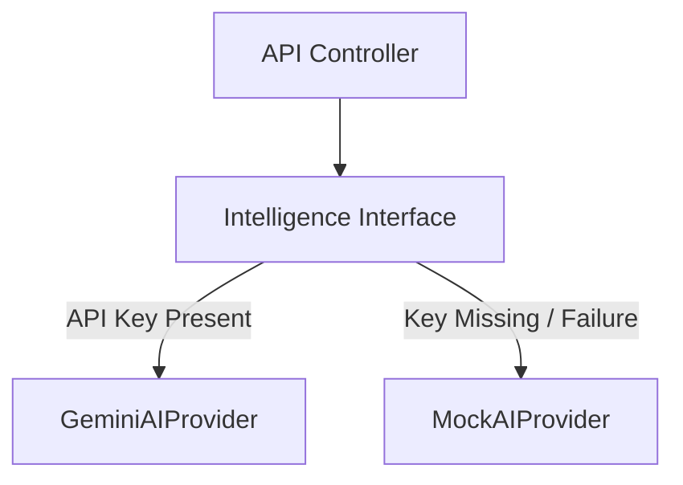

# AI Advisory Architecture
## Internal SIH College Management & Intelligence Platform

This document describes the design principles, boundaries, and fallbacks of the AI Intelligence Layer.

---

## 1. Core Principles

The AI Intelligence Layer provides advisory insights to students and administrators. It operates under strict security and engineering rules:
- **Advisory Role**: AI suggestions are recommendations only. The system does not automate high-stakes administrative decisions.
- **Explainability**: AI recommendations must return a confidence level (High/Medium/Low), reasoning summary, evidence references, and timestamp details.
- **Strict Isolation**: AI functions have read-only access to user data. They cannot bypass state machine constraints or mutate records.
- **Safe Fallback**: If external AI endpoints (e.g., Google Gemini API) are offline or fail, the platform suppresses recommendations, and core portal functions remain 100% operational.

---

## 2. Decoupled Provider Design

The intelligence layer uses an interface pattern to isolate the API implementation:
- **`GeminiAIProvider`**: Calls the official Google Gemini API using the `GEMINI_API_KEY` defined in the environment.
- **`MockAIProvider`**: Used when the Gemini key is missing or when the provider falls back due to rate limits. Generates simulated advisory responses locally.

---

## 3. Supported Workflows

### 3.1. Problem Statement Explanation & Matching
- **Action**: Students query the system for clarifications on complex problem statements.
- **AI Response**: Suggests matching skillsets and highlights target solution approaches based on team profile metadata.
- **Security Check**: AI does not create new official problem statement IDs or declare official releases.

### 3.2. Solution Proposal Readiness Check
- **Action**: Prior to final submission, the student requests a readiness scan.
- **AI Response**: Scans the draft text against the target problem statement's expectations. Evaluates stack coverage and provides feedback for missing requirements.
- **Display Label**: Marked clearly as `AI Advisory - Human Decision Required`.

### 3.3. Announcement Drafting Assistant
- **Action**: Coordinators request a draft announcement for deadline extensions.
- **AI Response**: Generates a professional tricolor-themed notification template.
- **Safety Gate**: The announcement remains in `DRAFT` status and requires manual coordinator review and approval before publication.

---

## 4. AI Audit & Logging Schema

Every AI transaction writes to `intelligence_audit_logs` to monitor rate limits, latency, and performance:
- `latency` (Float) - Tracks execution time.
- `status` (SUCCESS/FAILED)
- `confidence` (HIGH/MEDIUM/LOW)
- `provider` (Gemini/Mock)
- `model` (e.g., gemini-1.5-flash)
- `error` (Text, if failed)
