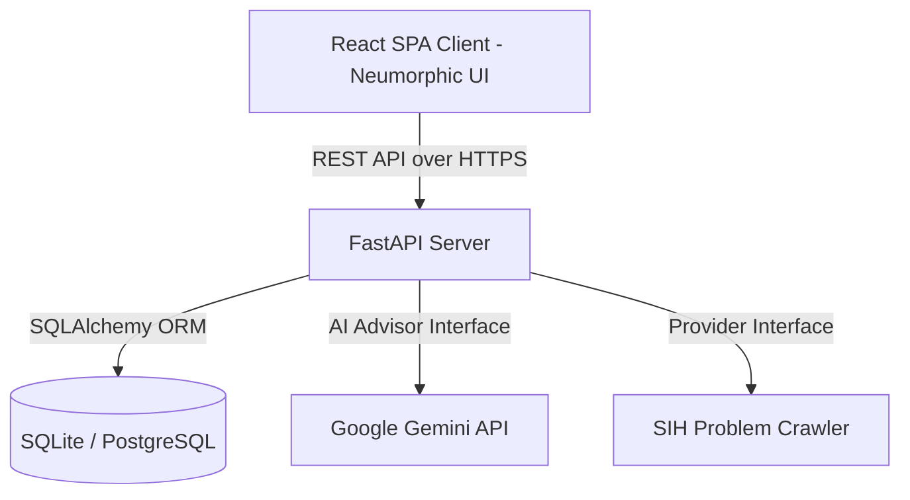
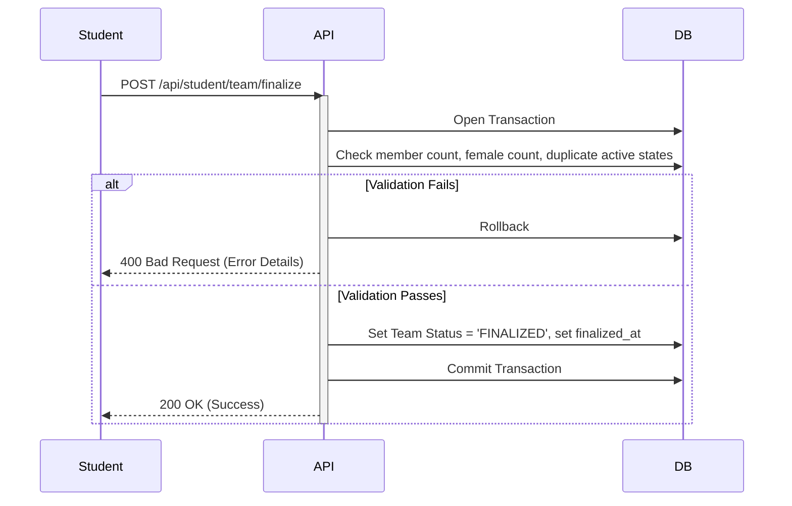

# System Architecture Design
## Internal SIH College Management & Intelligence Platform

This document describes the architectural layout, components, and data flow of the platform.

---

## 1. System Overview

The platform uses a decoupled client-server architecture:
- **Frontend**: A single-page application (SPA) built using React and Vite, utilizing a custom tricolor Neumorphic Soft UI design system.
- **Backend**: A high-performance, asynchronous REST API built with FastAPI (Python) and Uvicorn.
- **Database**: Relational SQLite database (for local dev and testing) or PostgreSQL (for production), abstracted through SQLAlchemy ORM.
- **AI Adapter**: Decoupled intelligence layer integrating Google Gemini with dynamic fallback mechanisms.

---

## 2. Component Design

### 2.1. Frontend Components
- **Router (`App.tsx`)**: Controls path mapping and handles role-based guard routing (`StudentRoute`, `CoordinatorRoute`, `JudgeRoute`, `SpocRoute`).
- **State Management**:
  - `AuthContext`: Tracks user session tokens, role, and college identity.
  - `ToastContext`: Provides floating alerts.
- **Authentication Forms (`StudentAuth.tsx`, `CoordinatorLogin.tsx`, etc.)**: Custom form pages implementing dynamic transitions and Neumorphic Soft UI inputs.
- **Dashboards**: Dedicated dashboard pages for each of the four roles, with multi-tenant data filters.

### 2.2. Backend Components
- **API Routers (`backend/app/routes/`)**:
  - `auth.py`: Handles token generation, logins, registrations, activation, and token expiry checks.
  - `student.py`: Manages profile, team actions, problem selection, and solutions.
  - `coordinator.py`: Implements judge assignments, scorecard unlocks, score overrides, and nomination proposals.
  - `judge.py`: Receives team evaluations and implements scoring locks.
  - `spoc.py`: High-level operations, logs auditing, sync trigger, and nomination approvals.
- **Services**:
  - `problem_statement_service.py`: Abstraction layer managing cached, mock, and official crawlers.
  - `intelligence/`: Custom explainable AI advisory routines.

---

## 3. Core Data Flow & Transactions

### 3.1. Authentication & Session Flow
1. User submits credentials to `/api/auth/login`.
2. Backend verifies email exists, hashes the password, and checks if account is `ACTIVE`.
3. If valid, backend generates a JWT containing user details, role, and college identity.
4. Client stores the JWT in local storage and includes it in all request headers as `Authorization: Bearer <token>`.

### 3.2. Team Finalization Flow

---

## 4. Multi-Tenant Isolation Model

Data isolation is enforced at the database query layer:
- Every table has a reference to the `event_id` or `college`.
- Whenever a request is made, the middleware or route dependencies extract the user's `college` and `event_id` from the JWT token.
- SQL queries strictly append filter conditions, e.g., `db.query(Team).filter(Team.event_id == current_user_event_id)`.
- Rejects IDOR/BOLA attacks by verifying ownership checks at the controller level before updating entities.
