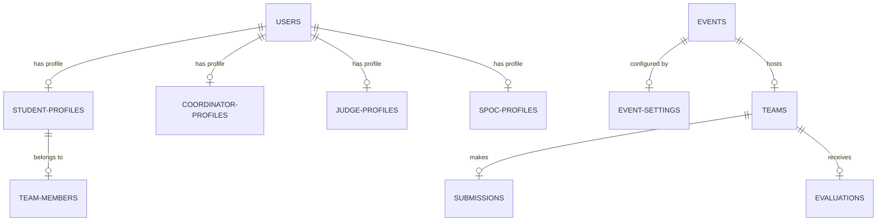

# Database Design Schema
## Internal SIH College Management & Intelligence Platform

This document describes the database tables, unique constraints, foreign keys, and indexes.

---

## 1. Entity Relationship Overview

The platform uses a relational database schema. Foreign key cascades are configured to prevent orphan records, and strict unique indexes guarantee data integrity at the database layer.

---

## 2. Table Specifications

### 2.1. `users`
- Stores credentials and status.
- `id` (INTEGER, Primary Key)
- `email` (VARCHAR, Unique, Indexed)
- `hashed_password` (VARCHAR)
- `role` (VARCHAR) - `student`, `coordinator`, `judge`, `spoc`
- `status` (VARCHAR, Default 'ACTIVE') - `INVITED`, `ACTIVE`, `DISABLED`, `SUSPENDED`
- `college` (VARCHAR)
- `created_at` (DATETIME)

### 2.2. `events`
- Configures individual college-level selection cycles.
- `id` (INTEGER, Primary Key)
- `name` (VARCHAR, Unique, Indexed)
- `academic_year` (VARCHAR)
- `college_name` (VARCHAR)
- `status` (VARCHAR, Default 'DRAFT')
- `nominations_submitted` (BOOLEAN, Default False)
- `nominations_approved` (BOOLEAN, Default False)
- `nominations_return_reason` (TEXT)

### 2.3. `teams`
- Track student cohorts and selection rankings.
- `id` (INTEGER, Primary Key)
- `event_id` (INTEGER, Foreign Key -> `events.id` ON DELETE CASCADE)
- `name` (VARCHAR)
- `leader_id` (INTEGER, Foreign Key -> `student_profiles.id` ON DELETE SET NULL)
- `status` (VARCHAR, Default 'DRAFT')
- `average_score` (FLOAT, Default 0.0)
- `selection_status` (VARCHAR, Default 'PENDING')
- `created_at` (DATETIME)
- `finalized_at` (DATETIME)
- *Constraint*: `UniqueConstraint("event_id", "name")` - Ensures team name uniqueness per event.

### 2.4. `team_members`
- Maps students to teams.
- `team_id` (INTEGER, Foreign Key -> `teams.id` ON DELETE CASCADE)
- `student_id` (INTEGER, Foreign Key -> `student_profiles.id` ON DELETE CASCADE)
- `event_id` (INTEGER)
- *Constraint*: `UniqueConstraint("event_id", "student_id")` - Prevents a student from joining multiple teams in the same event.

### 2.5. `submissions`
- Team solution proposal data.
- `id` (INTEGER, Primary Key)
- `team_id` (INTEGER, Foreign Key -> `teams.id` ON DELETE CASCADE)
- `problem_statement_id` (INTEGER, Foreign Key -> `problem_statements.id` ON DELETE CASCADE)
- `project_title` (VARCHAR)
- `proposed_solution` (TEXT)
- `pdf_url` (VARCHAR)
- `ppt_url` (VARCHAR)
- `github_url` (VARCHAR)
- `prototype_url` (VARCHAR)
- `status` (VARCHAR, Default 'DRAFT')
- `version` (INTEGER, Default 1)
- *Constraint*: `UniqueConstraint("team_id", "problem_statement_id")` - Prevents duplicate submissions.

### 2.6. `evaluations`
- Scorecard details.
- `id` (INTEGER, Primary Key)
- `team_id` (INTEGER, Foreign Key -> `teams.id` ON DELETE CASCADE)
- `judge_id` (INTEGER, Foreign Key -> `judge_profiles.id` ON DELETE CASCADE)
- `overall_comments` (TEXT)
- `total_score` (FLOAT, Default 0.0)
- `submitted` (BOOLEAN, Default False)
- `submission_version` (INTEGER)
- *Constraint*: `UniqueConstraint("team_id", "judge_id")` - Restricts evaluation to one scorecard per judge per team.

### 2.7. `audit_logs`
- Trace all sensitive actions.
- `id` (INTEGER, Primary Key)
- `actor_id` (INTEGER, Foreign Key -> `users.id` ON DELETE SET NULL)
- `actor_role` (VARCHAR)
- `action` (VARCHAR) - e.g. "TEAM_FINALIZATION", "SCORE_CORRECTION"
- `entity` (VARCHAR)
- `entity_id` (INTEGER)
- `college` (VARCHAR)
- `timestamp` (DATETIME)
- `reason` (TEXT)
- `metadata_json` (JSON)

---

## 3. Indexing & Optimization Strategy

To ensure high performance and sub-100ms response times for dashboards and reports, indexes are created on foreign keys and frequently queried fields:

1. **`idx_users_email`**: Enforces fast login lookups.
2. **`idx_events_college`**: Speeds up event isolation filters.
3. **`idx_teams_event_id`**: Optimizes dashboard team lists.
4. **`idx_student_profiles_user_id`**: Speeds up authentication state mapping.
5. **`idx_evaluations_team_judge`**: Accelerates score lookups for dashboard metrics.
6. **`idx_audit_logs_college`**: Facilitates fast multi-tenant audit retrieval.
7. **`idx_intelligence_results_college_event`**: Speeds up advisory recommendation dashboards.
