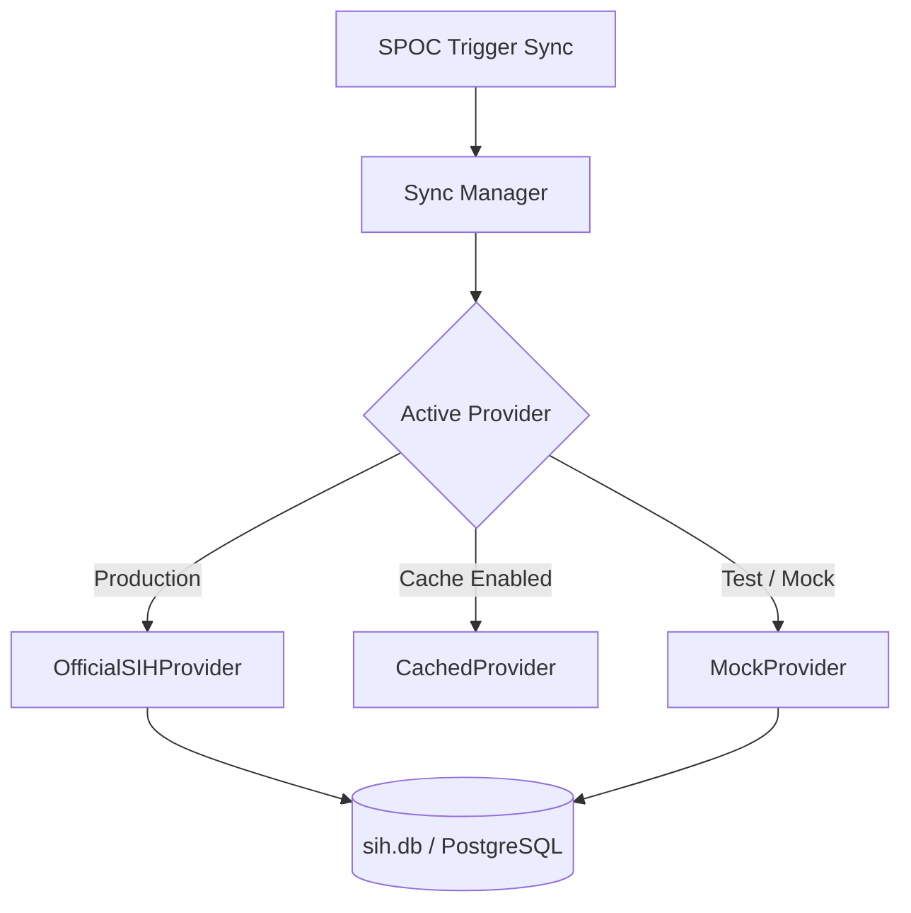

# SIH Problem Statement Synchronization Design
## Internal SIH College Management & Intelligence Platform

This document describes the synchronization crawler service, status tracking, and provider abstractions.

---

## 1. Synchronization Architecture

To prevent manual copy-paste errors, the platform features a crawler service that syncs the local database with the official Smart India Hackathon problem statements. 

---

## 2. Abstraction Interface

The synchronizer depends on a decoupled provider interface to query the official SIH lists:
1. **`OfficialSIHProvider`**: Scrapes the public SIH API / website, parsing categories, theme tags, organizations, and descriptions.
2. **`CachedProvider`**: Uses local json files containing cached official lists to avoid hitting the SIH server on every sync.
3. **`MockProvider`**: Seeds simulated problem statements for automated test coverage and local development runs.

---

## 3. Data Integrity & Release Status Lifecycle

Problem statements are edition-aware and maintain states to track updates:
- **`PENDING_RELEASE`**: A problem statement announced for the next hackathon edition but details are not yet loaded.
- **`RELEASED`**: Active, official problem statement available for student selection.
- **`UNAVAILABLE`**: A problem statement that was previously synced but is no longer present on the official SIH portal.
- **`ARCHIVED`**: Historical problem statements from previous SIH editions (e.g. SIH 2025).

### 3.1. Retention Policy (No Destructive Deletes)
- When a problem statement disappears from the official portal (e.g., if SIH archives it mid-event), it is marked `UNAVAILABLE`.
- **Zero Deletes**: The record remains in the database. Any team that has already selected or submitted a solution for this problem is NOT affected. This prevents breaking application states.

---

## 4. Execution Logging & Metrics

Every synchronization run writes to `problem_statement_sync_logs` to maintain audits:
- `sync_date`: Timestamp of execution.
- `source`: Crawler endpoint or local cache pathway.
- `status`: `SUCCESS` or `FAILED`.
- `fetched`: Total records processed.
- `created`: New problem statements inserted.
- `updated`: Existing records updated with new descriptions or themes.
- `unavailable`: Records marked `UNAVAILABLE` because they were missing in the latest fetch.
- `duration`: Execution time in seconds.
- `triggered_by`: The actor who executed the sync (e.g. SPOC username).
- `error_message`: Error traces if status is `FAILED`.
